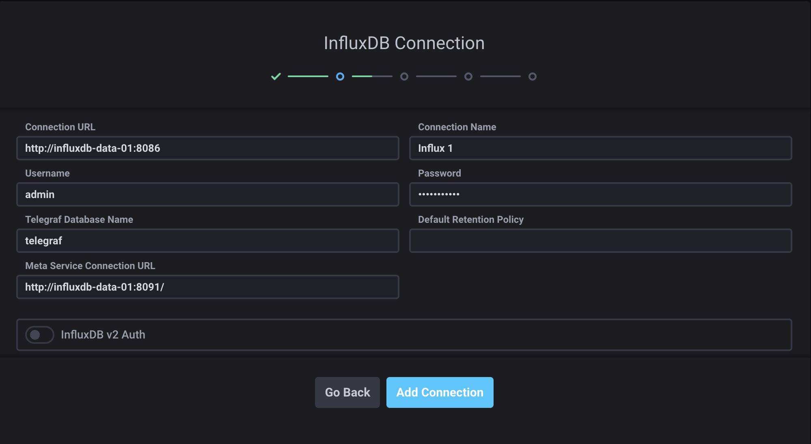
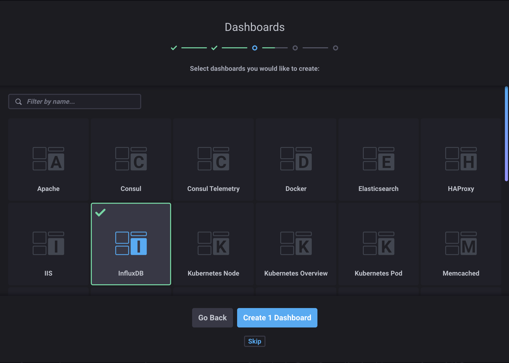
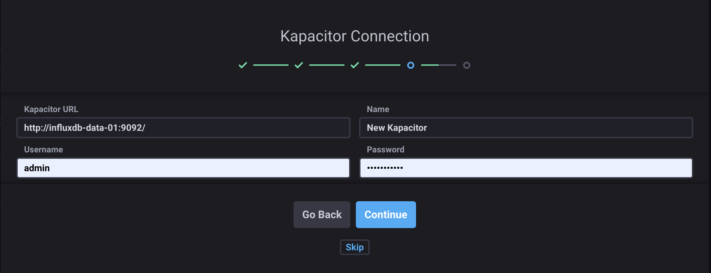
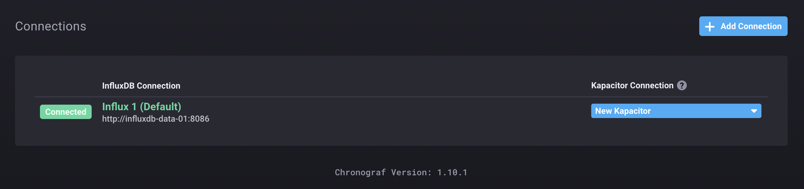
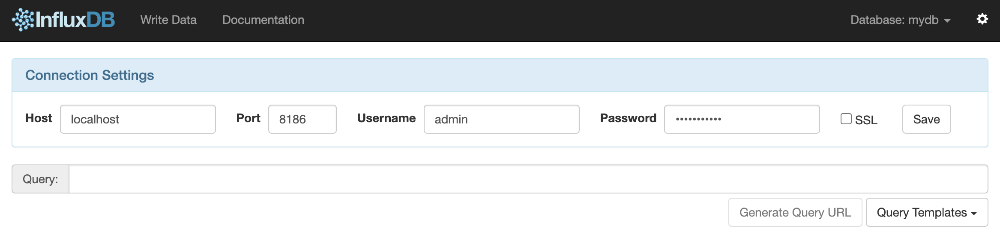

# influxdb-cluster

https://github.com/chengshiwen/influxdb-cluster

## Install InfluxDb Cluster

```shell
make install_influxdb
docker exec -it influxdb-meta-01 bash
influxd-ctl add-meta influxdb-meta-01:8091
influxd-ctl add-meta influxdb-meta-02:8091
influxd-ctl add-meta influxdb-meta-03:8091
influxd-ctl add-data influxdb-data-01:8088
influxd-ctl add-data influxdb-data-02:8088
influxd-ctl show
```

Output

```shell
Data Nodes
==========
ID	TCP Address		Version
4	influxdb-data-01:8088	1.8.10-c1.1.2
5	influxdb-data-02:8088	1.8.10-c1.1.2

Meta Nodes
==========
ID	TCP Address		Version
1	influxdb-meta-01:8091	1.8.10-c1.1.2
2	influxdb-meta-02:8091	1.8.10-c1.1.2
3	influxdb-meta-03:8091	1.8.10-c1.1.2
```

## Create your first database

```shell
curl -XPOST "http://influxdb-data-01:8086/query" --data-urlencode "q=CREATE DATABASE mydb WITH REPLICATION 2"
```

## Insert some data

```shell
curl -XPOST "http://influxdb-data-01:8086/write?db=mydb" \
-d 'cpu,host=server01,region=uswest load=42 1434055562000000000'

curl -XPOST "http://influxdb-data-02:8086/write?db=mydb&consistency=all" \
-d 'cpu,host=server02,region=uswest load=78 1434055562000000000'

curl -XPOST "http://influxdb-data-02:8086/write?db=mydb&consistency=quorum" \
-d 'cpu,host=server03,region=useast load=15.4 1434055562000000000'
```

## Query for the data

```shell
curl -G "http://influxdb-data-02:8086/query?pretty=true" --data-urlencode "db=mydb" \
--data-urlencode "q=SELECT * FROM cpu WHERE host='server01' AND time < now() - 1d"
```

## Analyze the data

```shell
curl -G "http://influxdb-data-02:8086/query?pretty=true" --data-urlencode "db=mydb" \
--data-urlencode "q=SELECT mean(load) FROM cpu WHERE region='uswest'"
```

## Create user

https://github.com/influxdata/docs.influxdata.com-ARCHIVE/blob/master/content/chronograf/v1.5/administration/managing-influxdb-users.md

```shell
curl -XPOST "http://influxdb-data-01:8086/query" --data-urlencode "q=CREATE USER admin WITH PASSWORD 'supersecret' WITH ALL PRIVILEGES"
```

Success

```
{"results":[{"statement_id":0}]}
```

## Chronograf Web Admin

```shell
make install_chronograf
```

http://localhost:8888/

- Login



- Dashboard



- Kapacitor (Skip)



- Connections



## InfluxDb Web Admin

http://localhost:8083/


